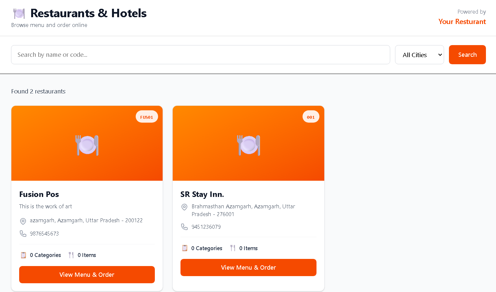
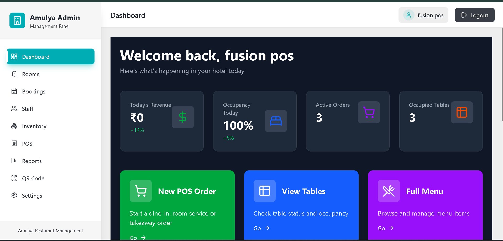
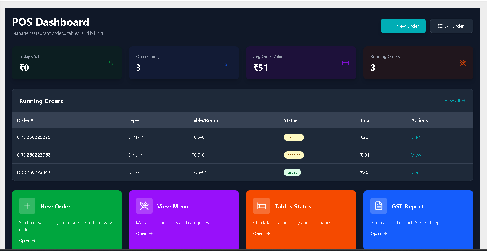
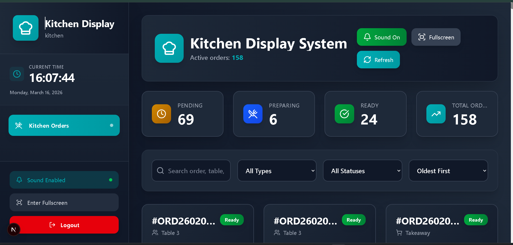
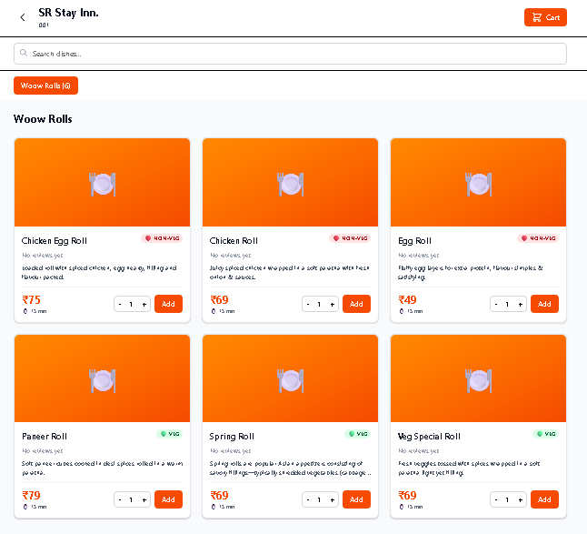
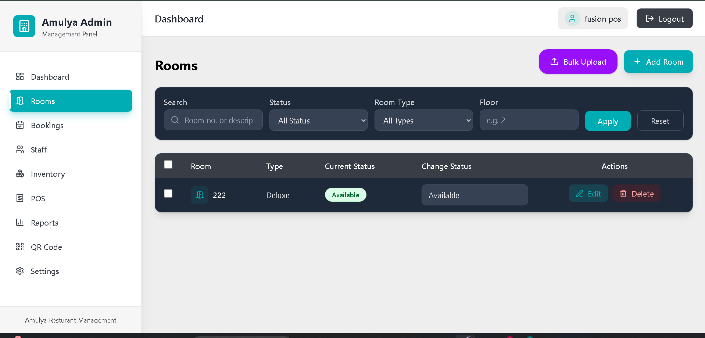
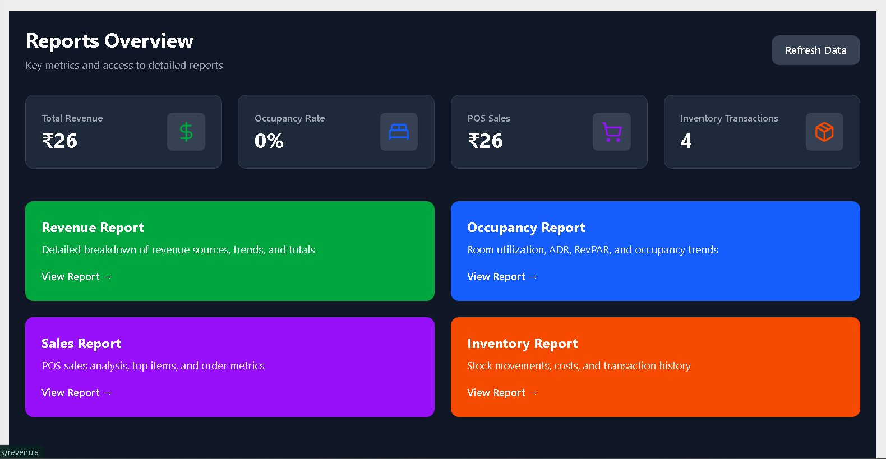

# 🏨 FusionPOS — Hotel & Restaurant Management System

A production-grade, real-time Hotel & Restaurant Management System built
for live client operations. FusionPOS handles everything a hospitality
business needs — from customer ordering and kitchen management to room
bookings, billing, inventory, and multi-property administration — all
updating in real time without a single page refresh.

**Live System →** [fusionpos.in](https://www.fusionpos.in)



---

## 🏗️ System Architecture

FusionPOS is built as a multi-tenant SaaS platform — one system that
manages multiple hotels and restaurants, each completely isolated from
the others, with role-based access control at every level.
```
Super Admin
    └── Creates Hotels / Restaurants
    └── Creates & Assigns Hotel Admins

Hotel Admin (per property)
    └── Manages Staff — Cashier, Kitchen
    └── Full control: Menu, Rooms, Inventory, Reports, POS

Cashier
    └── Takes Orders, Room Bookings, Billing

Kitchen Staff
    └── Receives real-time orders, marks ready

Customer (via /allinone)
    └── Self-ordering from table, takeaway, or home delivery
```

All roles operate on the same live system — every action reflects
instantly across all screens via WebSockets.

---

## ⚡ The Real-Time Core

This is what makes FusionPOS different from a standard management system.
Every critical operation is live — powered by Socket.io:

When a cashier creates a new order, the kitchen screen updates
**instantly** — no refresh, no polling, no delay. A notification sound
alerts kitchen staff automatically. When kitchen staff marks an order as
ready, the cashier's screen reflects it **immediately**. When a customer
orders from their table via the /allinone interface, it flows directly to
the cashier and kitchen in real time.

The entire operation runs as one synchronized, live system.

---

## 🛠️ Tech Stack

**Frontend**


**Backend**


**Database & Infrastructure**


---

## 🎯 Complete Feature Breakdown

### 🔐 Super Admin
The top-level administrator manages the entire platform. Super admin can
create hotels and restaurants, create hotel admins, and assign each admin
to their respective property. Each property is completely isolated — one
hotel's data never bleeds into another's.

### 🏨 Hotel Admin
Each hotel admin has full control over their assigned property — and only
their property. Their capabilities include complete menu management with
categories and subcategories, table creation and layout management, room
creation and availability control, staff creation and role assignment
(cashier, kitchen), inventory tracking and management, and comprehensive
reports across orders, revenue, and operations. Hotel admins can also
operate the POS system directly and take orders themselves.

### 💰 Cashier
The cashier role is purpose-built for speed at the counter. Cashiers can
take dine-in orders with table assignment, process takeaway orders, handle
room bookings, and generate bills. Every order they create triggers an
instant real-time notification to the kitchen — zero manual communication
required.

### 👨‍🍳 Kitchen Staff
Kitchen staff operate on a dedicated screen that shows only what they
need — incoming orders, in real time. When a new order arrives, their
screen updates automatically with a sound notification. When an order is
ready, they mark it done — and the cashier's screen reflects it instantly.
No calls, no printed slips, no miscommunication.

### 🍽️ Customer Self-Ordering (/allinone)
Customers can order directly without staff involvement via the `/allinone`
interface — available for dine-in (from their table), takeaway, or home
delivery. Their order flows straight into the live system, appearing on
the cashier's and kitchen's screens in real time. This reduces wait times,
eliminates order errors, and scales the restaurant's capacity without
adding staff.

---

## 📸 Screenshots

| Dashboard | POS System | Kitchen Screen |
|---|---|---|
|  |  |  |

| Customer Ordering | Room Booking | Reports |
|---|---|---|
|  |  |  |

---

## 🚀 Run Locally

**Frontend**
```bash
git clone https://github.com/MdWarishh/fusionpos-frontend
cd fusionpos-frontend
npm install
npm run dev
```

**Backend**
```bash
git clone https://github.com/MdWarishh/fusionpos-backend
cd fusionpos-backend
npm install
node server.js
```

**Environment Variables needed:**
```
MONGODB_URI=your_mongodb_connection_string
JWT_SECRET=your_jwt_secret
SOCKET_PORT=your_socket_port
```

---

## 👥 My Contribution

FusionPOS is a collaborative project. I owned the complete frontend
of the platform:

- Built the entire frontend from scratch using Next.js & TypeScript
- Designed and implemented all role-based dashboards — Super Admin,
  Hotel Admin, Cashier, and Kitchen screens
- Integrated Socket.io on the frontend for all real-time operations —
  live order flow, kitchen notifications, and status updates
- Built the /allinone customer self-ordering interface — dine-in,
  takeaway, and delivery flows
- Connected all frontend components with backend REST APIs and
  WebSocket events
- Ensured fully responsive design optimized for counter use (cashier),
  kitchen display, and customer mobile devices

---

## 💼 Available for Custom Deployment

FusionPOS can be customized and deployed for any hotel, restaurant, or
hospitality business. The multi-tenant architecture means a single
deployment can manage multiple properties simultaneously.

Interested in deploying FusionPOS for your business?
→ [warishmohd519@gmail.com](mailto:warishmohd519@gmail.com)

---

*Built by [Md Warish](https://github.com/MdWarishh) — Full-Stack Developer
building production-grade systems for real businesses.*
